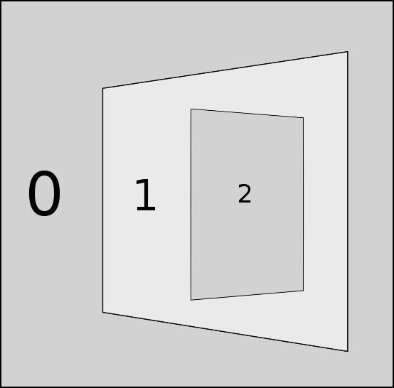
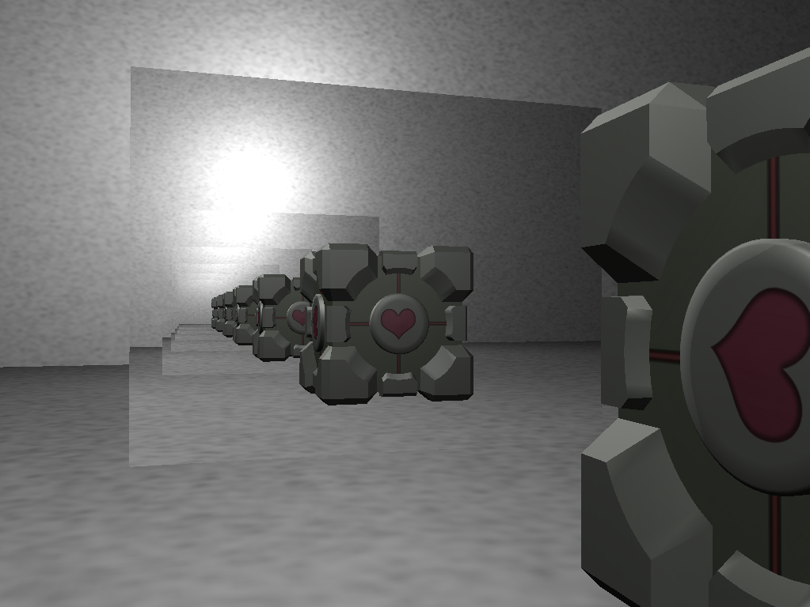
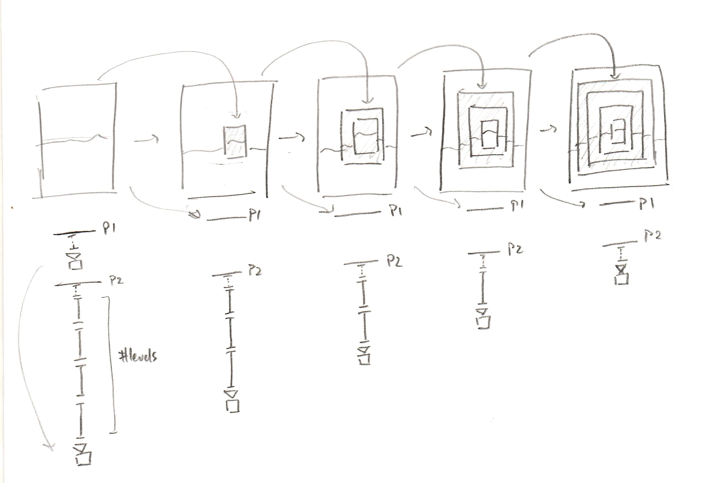
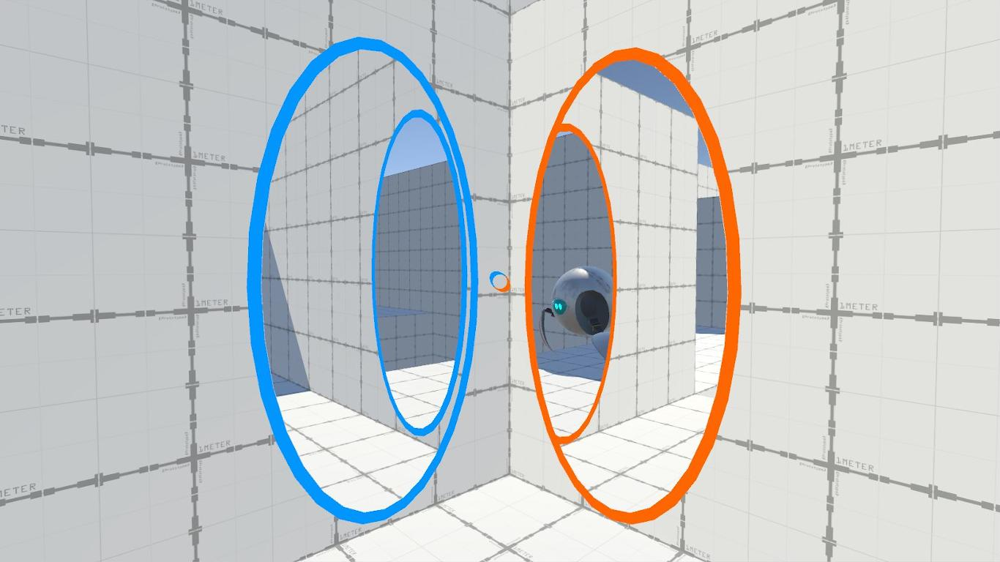
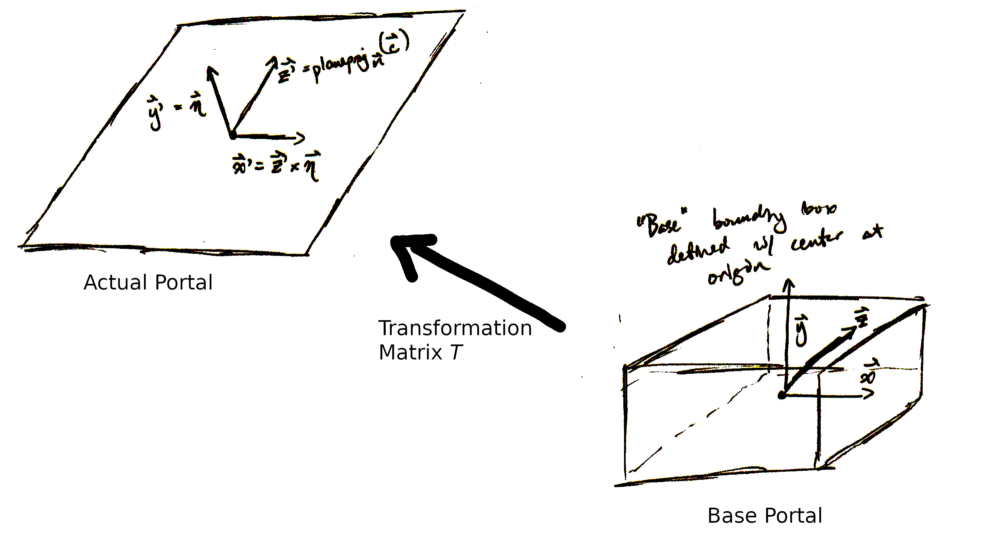
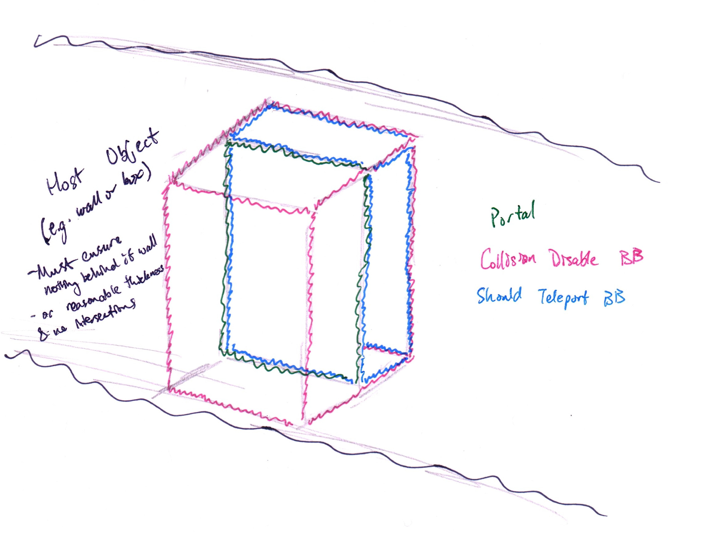
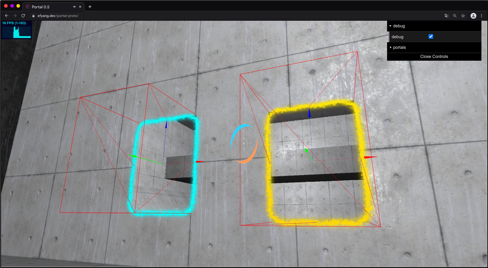
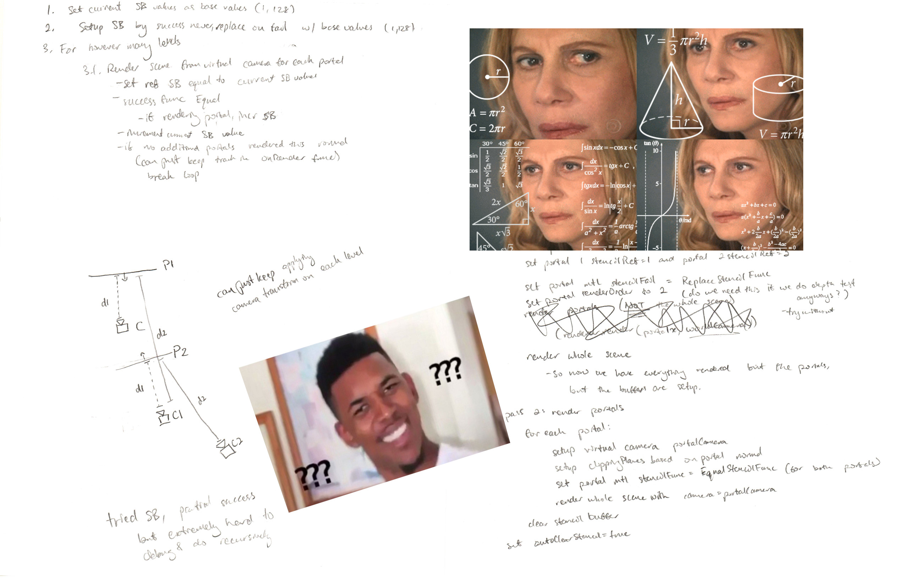
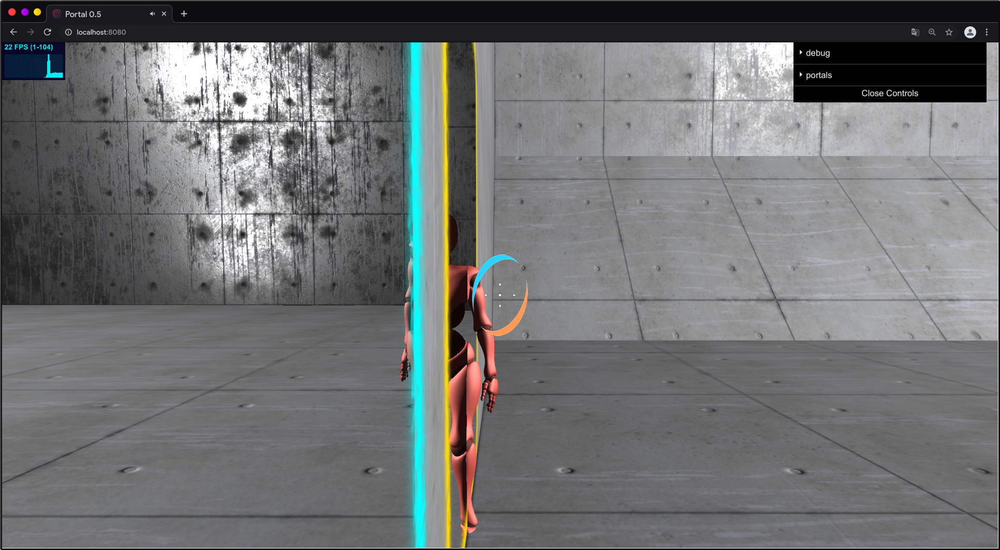
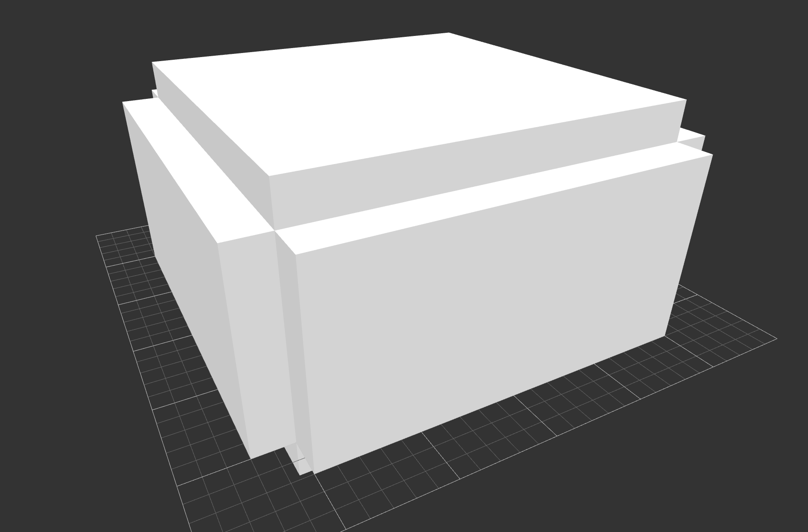

# Portal 0.5
[Online Demo](https://efyang.dev/portal-0.5/)

## Abstract/Introduction
Portal 0.5 is an exciting first-person game where a player can instantaneously teleport themselves to new locations via portals that they shoot onto surfaces. Players can explore their environment while enjoying the novelty of teleportation and interesting physical interactions. Portal 0.5 leverages the Three.js and Cannon.js libraries to deliver a comprehensive, visually appealing, and fun demo of the Portal games.

### Goal
Our goal in this final project was to create a demo of the popular Portal games developed by Valve. Specifically, we hoped to implement the core technical features of the game, including rendering, teleportation, and physics. We hope that our demo captures the experience of playing the actual games.

### Previous Work
There have been multiple instances of people reproducing some of the core mechanics of portal, especially the rendering aspects. Most notably, these authors include [torinmr](https://torinmr.github.io/cs148/), [Thomas Rinsma](https://th0mas.nl/2013/05/19/rendering-recursive-portals-with-opengl/), and [Daniel Ilett](https://danielilett.com/2019-12-01-tut4-intro-portals/). Much of our own implementation drew from ideas in their work.

#### Rendering
For rendering portals, the general idea seen in most methods is to place a virtual camera in the position and orientation of the main camera having been "teleported" by its respective portal. This camera would then have a clipping plane equivalent to the output portal's normal plane (so that the object the output portal on would not occlude this view). In this way, one would be able to "see" the scene from the output portal, while still implicitly encoding distance information present in the original camera position. This creates a simple view through a portal which can then be either applied to the input portal mesh through means of setting its texture or using the stencil buffer. The more complex part of portal rendering is to render recursive portals.

In particular, there seem to be two main approaches to drawing recursive portals described in previous works. One of the more complex methods, used by torinmr and Thomas Rinsma in their implementations, involved the usage of the stencil buffer in order to cull the outline of each successive portal render. The stencil buffer is basically another buffer (like the depth buffer) which can be used to check whether to render a specific pixel given the value in the buffer for that pixel location, and some given reference value to compare that stencil buffer value to. On each full scene render, the stencil buffer would first be cleared to be all 0s. The portals themselves would first be rendered with some base reference stencil value, and replace the value in the stencil buffer at the location of its pixels with some set reference value for the portal (e.g. 1), or even increment the current value in the stencil buffer. Successive recursive iterations of portals would then be drawn using the new/incremented stencil buffer as their reference value. Each iteration would teleport the camera through the portal again, thus rendering the new iteration of the portal from a further vantage point and therefore modifying the stencil buffer.

 
<i>
Example of what a stencil buffer might look like using the stencil buffer method after 2 iterations (c. Thomas Rinsma)
</i>

This method achieves very good results, and seems to have very good performance:

 
<i>
"Companion Cube sees itself" (c. Thomas Rinsma)
</i>

The other main approach, as used by Daniel Ilett, is to render each virtual camera iteration to a texture, and directly replace the portal texture with this texture. This texture is then shaded with a special screen-space shader (so that it isn't just shrunk down to the portal mesh size), which maps each coordinate on the mesh to its actual screen-space coordinates and uses these screen-space coordinates to map the texture (avoiding the shrinking problem). This requires that the portals then be rendered deepest-first, which can be done by teleporting the camera however many times the recursion goes first, and then undoing each teleportation on every recursive portal render iteration. An example of how a portal would be rendered is seen below:

 
<i>
Rendering process using the screen-space shading method.
</i>

This method achieves comparable results quality-wise compared with the stencil buffer method, at the cost of some performance due to having to swap and load the texture out:

 
<i>
Rendering using the screen-space shading method (c. Daniel Ilett)
</i>

### Approach
Our demo builds upon the provided starter code in order to provide a smooth gameplay experience to the player. All the objects in our demo leverage the Three.js library for graphics, and the Cannon.js library for physics. 

At the beginning, our approach was to first implement a simple planar scene and a simple box for a player model. This was helpful in getting acquainted with the Three.js and Cannon.js classes that we would use throughout our project. Specifically, this helped us get used to creating graphical components and attaching physical bodies to them. In addition, this was an important first step because it allowed us to observe how a simple dynamic component (the player model) interacted with static components (the scene). This would help us throughout the development process to pinpoint bugs in our code. 

The next step was to add additional elements to the scene. To do this, we played around with multiple Three.js and Cannon.js objects in order to see what worked. During this time, we also began thinking about what objects would be useful for the implementations of future features such as portals. For example, we decided to use boxes rather than planes to construct the walls, floor, and ceiling in our scene because we needed the thickness of the boxes in order to make portal teleportation smooth. Having this forethought was incredibly useful because it allowed us to avoid having to re-implement multiple features down the line. We also discovered the Three.js Editor application early on and thought that it would be a good idea to use it to visualize and construct scenes. Since the application exported json files, we modularized code that constructed the corresponding Three.js and Cannon.js objects automatically, allowing us to efficiently design and incorporate scenes. This was helpful both for debugging and for creating more complex scenes.

After that, we began working on the more interesting features, namely the portals, player models, audio, textures, and lighting. Our approach was to split up the responsibility for the features so that we could work asynchronously and cover more ground while communicating clearly on our progress and challenges. This proved to be a good strategy since it facilitated a combined expertise on multiple features in a short amount of time. To make communication easier, we utilized GitHub Issues to mark bugs and features for future reference. 

One thing we could have done better was to discuss features even more in depth and more frequently to ensure that we were exactly on the same page. There were a few times where we had to re-implement a feature due to miscommunication, which hindered our progress. However, we are still very proud of what we were able to accomplish in the short time frame given to us. 

## Methodology
### Project Structure
The project is structured in the following manner: 

- /src/:
    - app.js: entry point into the code. Here, the renderer, scene, camera, and shader are initialized, and portals are rendered. In addition, the onAnimationFrameHandler is setup here which consolidates the updates to the application in every timestep. Also, the instruction page is loaded in here
    - globals/: this is where global and const variables are defined and initialized for conveniency
    - components/: 
        - crosshair/: contains the crosshair class which sets up the crosshair
        - jsons/: contains all the json files for the scenes (from the Three.js editor)
        - lights/: contains the lights class which sets up the lights
        - objects/: contains the implementations for all of the objects used in the demo
        - scenes/: loads all the objects into the demo
- /assets/: contains sound clips and textures 

### Frameworks
We chose to utilize the existing project structure, which uses Three.js for 3D object handling and rendering. There exist many alternative web rendering libraries, but Three.js was already familiar to us from other COS426 assignments and was already setup for us to work with. We chose Cannon.js because this already had some documentation for usage in conjunction with Three.js and shared much of the same design philosophy as Three.js, which enabled us to get started with it very quickly. For the documentation reason we decided to choose this library over other libraries, but other js physics libraries would probably have worked just as well. We chose to use a physics library instead of rolling our own despite having simple shapes because there simply wasn't enough time to build and debug a working physics implementation from scratch, and we needed to use advanced features of Cannon.js (such as collision filter groups and masks) to achieve the effects that we wanted with portals. Building a whole physics implementation from the ground up was also not the main focus of our project, and our portal implementation ended up being very compatible with Cannon.js.

### Physics
As mentioned, we decided to use the Cannon.js framework for physics. For each static and dynamic object, we defined an equivalent Cannon.js `Body` and added it to the world. For the player model in particular, we found that a simple box body was enough to represent the character's physical body and handle basic collisions, but that could be easily changed in the future. All static objects simply had their masses set to 0, which is the standard way to make objects ignore gravity and be immobile in Cannon.js. This created a relatively easy to debug and think about framework for us to work with. To move the player, we simply applied a force or impulse to the `Body` of the player depending on which keys were currently pressed.

Getting proper friction was one of the challenges we faced with physics. We wanted the player's model to always stay upright and always face towards the camera, and so this had to be reflected in the physics `Body` for the player as well. However, when friction between the player and the surface was too high, this would result in bouncing, jittering, and loss of contact with the ground when one tried to move, and was not ideal (because the player `Body` was a box). We solved this by setting friction to essentially 0, and instead using Cannon.js's linearDampening feature on the player `Body`. This would dampen the player's movement as they got too fast, essentially acting like friction.

However, this created problems with jumping and proper gravitational effects. The player would slow down immensely while jumping because of the high linearDampening required to achieve surface friction, which was not physically realistic enough for our purposes. To solve this, we would detect whether the player was in contact with a ground object every iteration, and if not, we would count this player as in a jump and thus reduce the linearDampening for the player while they were in a jump, and also reduce the force applied on movement keys to compensate. This worked very well, which allowed us to have both smooth surface friction and also have proper gravitational momentum.

Another crucial portion of physics was the ability to disable collisions to allow for proper portal behavior, which we will discuss later on.

### Portal Structure and Teleportation Transform
Physically, each portal consists of a main mesh `BoxGeometry` where the portal teleportation visuals would be rendered, a plane mesh slightly in front of this mesh that provides a surface for the portal ring texture, and 2 custom non-axis-aligned bounding boxes. For a given portal, we define a matrix which transforms the portal from the origin with y axis looking up to its current position and orientation. We also keep a reference to its paired output portal. The transformation matrix is essentially a simple basis transform which maps the y-axis to the normal of the portal's host surface, and the other two axes to the player's up direction and forward direction that has been combined with the normal to create an orthonormal basis. Thus, we can define all parts of the portal centered at the origin, and simply apply this transformation matrix in order to get its actual position. This transformation is visualized below.

 
<i>
How a base portal is transformed by its transformation matrix
</i>

This definition forms the basis for our method of teleporting through portals. To teleport a point from one portal's coordinate frame to another, we first apply the input portal's inverse transformation matrix. Because our idea of portals has them "back-to-back" in the conceptual view (like each side of a window), we have to flip the transformed point's x and y coordinates. After this, we apply the output portal's transformation matrix in order to get the final teleported position. To transform a directional vector, we do the same thing, except that it does not make sense to translate a directional vector, so we only apply the rotational components of both matrices. This allows us to teleport both the position and orientation of any object, as well as physical quantities such as velocity or force. The code describing this can be found in `src/components/objects/Portal.js`.

A particular edge case for this transformation is that when we teleport the actual player, we want the player to be "self-righting": that is, the player's up direction even after the transformation should always face towards the global up direction, and there should be no roll present in the player camera. To solve this case, we use a modified variation of [Daniel Ilett's method](https://danielilett.com/2020-01-03-tut4-4-portal-momentum/) in his Portal tutorial series. After teleportation, we create a new basis where the forward direction is the current forward direction, and the up direction is the global up direction. The right basis direction is then the forward direction crossed with the up direction. The actual up direction (to form an ONB) is then the right basis direction crossed with the forward direction. This becomes the player camera's new rotation matrix, and we set its quaternion to reflect this.

Additionally, the two bounding boxes are defined as shown below. These two bounding boxes are named the CDBB (Collision Disable Bounding Box) and STBB (Should Teleport Bounding Box). These bounding boxes are used to selectively disable collisions between objects and the portal's host object, and also to determine whether the object should teleport through the portal on each world update. Note that the STBB is a subset of the CDBB for this reasoning. When a dynamic object is within the CDBB, the collisions between that object and the portal's host object are temporarily turned off for that world step, to allow the object to "go through" or "go into" the portal. When a dynamic object is within the STBB, the object is teleported through that portal.

 
<i>
Where the CDBB and STBB are located relative to their associated portal.
</i>

 
<i>
Example of debug mode portals showing their basis and CDBB in-game.
</i>

### Portal Rendering
As mentioned in the *Previous Work* section, there were two major established approaches to rendering portals: using the stencil buffer or using a screen-space shader along with rendering to textures. Given the time constraints of the project, it seemed most reasonable to attempt to implement one of these methods instead of finding a whole new method to render portals. In the prototyping phase of the project, we tried to implement the stencil buffer approach first. While the performance seemed to be promising as far as we got it (basic non-recursive portal rendering), it ended up being very hard to implement the actual recursive steps of the portal rendering. This difficulty was further compounded by the fact that the stencil buffer is completely opaque, and so there wasn't a really easy way to see which values were currently in the stencil buffer in order to debug our implementation. Furthermore, recursive rendering with the stencil buffer is very hard to reason about in practice, and therefore debug. For this reason, and our subsequent comparatively quick success with the screen-space shader method, we decided to go with the screen-space shader method.

 
<i>
Attempting to understand the stencil buffer method.
</i>

To implement the screen-space shader method, each portal mesh had a special screen-space shader and associated texture uniform which mapped each pixel to its screen-space coordinates, and then used those screen-space coordinates to get the pixel in its associated texture uniform. They also included screen dimension uniforms in order to keep rendering correctly even after screen resizes.

On every render pass we created a virtual camera for each portal that was a simple clone of the main camera. We updated the screen dimension uniforms associated with each portal in order to reflect the screen size in the screen-space coordinate calculation correctly even after window resizes. We teleport the virtual camera for each portal through the portal `PORTAL_RECURSION_LEVELS` times in order to put the camera at the equivalent virtual location that would render the deepest instance of the given portal. Then we also set both portals as invisible, as the texture for the portal at initialization is essentially garbage values that we do not want. For each iteration, we set the clipping plane as the plane of the output portal, in order to correctly cull objects that might otherwise occlude the virtual camera. We render the target into a texture, and then set the portal to use this texture and set it as visible again. Because when looking through one portal one will never see the other output portal, we keep the output portal hidden through this process so that there aren't visual artifacts caused by accidentally keeping it visible. We then undo the camera teleportation by one teleportation, and then continue the loop. For a visual reference (same as the one in the *Previous Work* section), refer below:

 
<i>
Example rendering process using screen-space shading.
</i>

Note that we do actually use the stencil buffer in this process, but not to actually render the portals. The stencil buffer optimization is only to mark off places where the portal will actually be, therefore culling much of the scene in the process. In practice, we haven't seen much of a performance boost, however, even with this on. This optimization is much smaller and easier to reason about, which is why we included it.

After both portals are rendered, the whole scene is then finally rendered normally. It's important that both portal main meshes use `MeshBasicMaterial` as opposed to `MeshStandardMaterial`, as this avoids having reflectivity or lighting artifacts from the scene that should not be present on a portal surface.

The relevant rendering code can be found in `src/app.js` and `src/components/objects/Portal/Portal.js`, with some associated globals and constants located in `src/globals/`.

One snag we ran into was how Three.js handled render targets and their respective textures. Three.js does not allow recursive texture rendering; that is, rendering to a texture while using that same texture in the scene. This makes sense as a limitation, as this usage case is not very common. However, this requires that we create a temporary render target in addition to the render target for each portal texture. On every portal render step, we render to the temporary target, and then swap the two render targets, using this rendered texture as the texture for the portal while providing a render target to render the next iteration. By swapping, we avoid having to instantiate multiple new render targets and dispose of them on every iteration, and also create a workaround to Three.js's recursive texture rendering limitation.

One additional corner case we had to consider was that an object could be partially "within" a portal but not have teleported yet. In this case, the other output portal should show the part of the object that has "teleported". To achieve this effect, we use the same method as [Daniel Ilett](https://danielilett.com/2020-01-03-tut4-4-portal-momentum/): we create a clone of the object's mesh when it is within the portal's CDBB and then teleport that mesh, and show it in the main scene render.

 
<i>
"Where am I?"
</i>

Using our method, we achieve good quality results, but take large performance hits (to be discussed in a later section):

 
<i>
A classic corner case.
</i>

### Portal Placement
To determine valid portal placement, we follow a procedure detailed here. First, we instantiate a Raycaster object from Three.js to find objects that intersect the ray originating from the player and pointing in the direction of the cursor. If the ray intersects at least one object, we consider if a portal can be placed at the point of nearest intersection, *P*, on a face *F* with normal *N*. To do this, we calculate the four corner points of the portal-to-be in world coordinates and check if each point is valid. To determine validity, a new Raycaster object is created with origin (*P* + *N*) and with direction (-1 * *N*), and we check that the first face the new raycaster intersects is equivalent to *F*. Essentially, this is checking that all four corners of the portal-to-be lie unobstructed on the face of nearest intersection of the original raycaster. To ensure this works, the scenes we generate must have edges like such where two faces meet: 

 
<i>
Example of necessary scene constructions.
</i>

Furthermore, we need to determine if the portal-to-be overlaps with an already existing portal. To check for overlap, we first compute intermediary points along the edges of the portal-to-be. This is necessary because we check if any of the points along the edges of the portal-to-be (including its corners) fall inside an already existing portal. Since portals can only overlap when they are on the same surface (thanks to our previous validity checking), the portal-to-be can only overlap with the existing portal if they are in the same dimension. This makes checking for overlap easy since we can loop over the edge points of the portal-to-be and check whether each point is inside the existing portal or not. To do so, we follow the formula outlined [here](https://math.stackexchange.com/questions/190111/how-to-check-if-a-point-is-inside-a-rectangle), and we compute the area of triangles following the formula outlined [here](https://math.stackexchange.com/questions/128991/how-to-calculate-the-area-of-a-3d-triangle). These formulas essentially check whether the sum of triangle areas formed by each edge point of the portal-to-be and each pair of adjacent corners on the existing portal exceeds the area of the existing portal. If it exceeds, then that edge point falls outside of the existing portal. If all edge points fall outside of the existing portal, then the portal-to-be does not overlap the existing portal. If both the previous validity check and this validity check pass, then the portal-to-be is deemed valid and is placed at the point of nearest intersection.

### Collision Filtering for Portals
To have proper portal teleportation behavior, we have to selectively disable collisions between portal host objects and dynamic objects that are within their CDBB. To achieve this, we utilize the `collisionFilterGroup` and `collisionFilterMask` attributes provided by Cannon.js, described [here](https://github.com/schteppe/cannon.js/blob/master/demos/collisionFilter.html). It is important to note that the definition for collisions being enabled is symmetric: that is, between bodies A and B, *both* bodies must have the other body's `collisionFilterGroup` as part of its `collisionFilterMask`. This means that as long as we remove one half of the condition, we will still disable collisions, which we take advantage of to simplify our logic.

At initialization, all environment objects are added to an environment collision group `CGROUP_ENVIRONMENT`. All dynamic objects are added to a dynamic collision group `CGROUP_DYNAMIC`. All environment objects collide with all dynamic objects. All dynamic objects collide with all objects. When a portal is created on a host object, that host object is removed from the environment collision group and added to a special collision group specific to each portal. By default (on every world step start), a dynamic object will have a mask corresponding to all groups. When a dynamic object enters a portal's CDBB, the dynamic object has the portal host object's collision group removed from its collision mask (for that iteration). This turns off collisions between the dynamic object and the portal host object, as required. This way, if the dynamic object leaves the portal's CDBB in the next iteration, it will again collide with everything. Note that this means that a host object could be in both portal's host objects, if both portals were put on the same host object, and this case would still be handled perfectly fine. Finally, when a portal is removed from a host object, the host object is removed from the portal's collision group. Only if it is in neither of the portal collision groups is it added back into the environment collision group. This successfully handles all collision cases that we needed and would allow more dynamic objects besides the player to be added in and handled without any change to the collision filtering system.

### Scene Building / Design
To build scenes we utilized the Three.js Editor found here: https://threejs.org/editor/. This editor made visualizing and manipulating scene objects very accessible. After constructing a scene in the editor, we downloaded the entire scene as a json file which includes crucial information such as the dimensions of objects and their respective matrix transformations. We use this information to automatically generate the corresponding Three.js and Cannon.js objects and add them to our scene. One limitation of this approach is that we can only use boxes and not other objects such as cylinders and rings in our scenes. This is because we have hardcoded the generation of specifically box Three.js and Cannon.js objects using the information from the json files. This can be improved by checking for the type of object in the json files while generating the objects, but we found this unnecessary because boxes allow us sufficient flexibility already. Another advantage of using the Three.js editor is that we can give objects specific names, which allows us to determine special properties of certain scene elements. For example, we can name an object "unplaceable_0" in the editor and disable the placement of portals onto that object in our code. 

### Textures / Visual Design
Some of the custom textures (the crosshair and portal borders) were designed through Inkscape and GIMP. The crosshair was first designed in Inkscape, and then rendered to a png and edited using GIMP to make it easier to use as a texture with the square mesh that we were using for the crosshair. The portal borders were designed in GIMP to match with the dimensions of the portal itself and used a combination of GIMP filters (including cubism, blurring) to achieve the desired texture. The texture itself was made in all white, so that each portal could simply apply its own color to the texture and there wouldn't have to be two redundant textures for the portal.

To create a somewhat more realistic feel, we used high quality CC0 textures which included roughness, normal, displacement, and ambient occlusion maps in conjunction with Three.js's standard pbr material, `MeshStandardMaterial`. This greatly assisted in creating a more realistic feel in the scene that wasn't completely flat.

### Player Model and Movement
Player movement is controlled by WASD (movement) and Space (jump) keypresses. This is accomplished through event handlers that mark keys as pressed in a JavaScript object. Upon each render loop, if a given movement key is pressed then a force is applied to the model's Cannon.js physical body in the appropriate direction. We also account for multiple movement keys being pressed at once (for example, "W" and "A"), and scale the force accordingly. This implementation is advantageous because it allows the player to move in the four standard directions (up, left, back, and right) as well as combinations of them. Jumps are implemented in a similar fashion where a force is applied upwards onto the Cannon.js body. At the end of the render loop, the model's graphical body's position is updated to match its physical body's location, which maintains correctness. 

Player models were obtained from Mixamo, which provides character models and animations for free in fbx format. As such, we used the FBXLoader class of Three.js in order to load in downloaded models and animations, following a guide here: https://sbcode.net/threejs/fbx-animation/. Player model animations are essentially loaded in and saved into an array and depending on which key(s) are pressed, an animation is played. In total we incorporated forward running, backward running, left strafe, right strafe, falling, and idle animations. Smooth animation transitions are accomplished by fadeOut and fadeIn methods provided by the FBXLoader. 

### Audio
Audio is implemented using the AudioListener, AudioLoader, and Audio classes in Three.js. Copyright-free sound clips were sourced from YouTube and https://freesound.org, and all files were converted to mp3. This includes sounds for background music, jumping, landing, portal gun fires/errors, and teleports. Audio is important because it enhances the gameplay experience and provides important indicators of valid portal placements, which is an essential feature in the game. In the code we have different Audio objects for different sounds in order to avoid sounds from interfering with one another. The Audio class also allows us to adjust the volume and settings of each sound independently, which is useful for polishing our demo. 

## Discussion

The end result of our project was a success. We accomplished the original MVP goals we had set out for ourselves and implemented additional features such as textures, audio, and smooth player animations. We asked our friends, several of whom had played through the original Portal games, to demo our project, and most of the feedback was positive. They commented on the likeness of our demo to the original games, and how portal teleportations were executed well. They also commented that the overall aesthetic of the game was impressive, and that textures, audio, and animations added significantly to the enjoyment of the demo. However, they also found the fps to slightly hinder the experience since low fps rates could dramatically slow down player movement. Additionally, many said they would like to see an expanded scene that incorporates puzzle-solving elements so that it is a more complete demo. Taking this feedback into account, we have achieved a tremendous goal of replicating the highly touted Portal games, but there are still many improvements that could be made to our project.

### Next Steps
One particular part of our project that could be optimized further is the performance (as of this writing). Without placing any portals, We tend to basically max out the frame rate of the monitor that the demo is running on. However, whenever both portals are placed and especially at certain view angles, the framerate drops immensely. We measured a drop to around 30-50 fps on one configuration with portal recursion set to 3, and this only further decreased down to around 10-20 fps with greater portal recursion rendering levels. While part of this could be chalked up to nodejs' single-threaded nature, the reality is that most webgl computations are supposed to be gpu-optimized even running in the browser and so a higher framerate should be achievable. Most likely part of the issue is with how we are culling our scene. While we do already use frustum culling with the portal virtual cameras and also use a simple stencil buffer culling optimization, it seems that each portal recursion step still ends up being too expensive. Perhaps this could be solved by using the full stencil-buffer rendering approach as Thomas Rinsma does, but given Daniel Ilett's success even with our current screen-space rendering method, it seems likely that we are running into some areas of inefficiency. This could be due to the frustum culling not working as expected or culling enough of the scene. Binary space partitioning, octrees, scissor tests, or other methods of further culling is a possible method that could be used in the future to allow for higher framerates and performance in general.

This performance issue is somewhat more apparent with physics as well. When the framerate gets low, the whole demo slows down perceptually, including the physics because the physics engine steps on every render step. Being able to decouple these would allow the game to run much more consistently smooth, without the framerate affecting the physics simulation. We're not entirely sure this is possible given the frameworks that we are using, as nodejs is inherently single-threaded, and just as well making the game multithreaded would greatly increase the complexity of the project in whatever language it is implemented in.

Another improvement that could be made to the project is including more extensive level design. Since a major gameplay element of the original Portal games is the puzzle-solving, we could design our own puzzle stages using the Three.js editor. Other ideas we had include solving a maze using portals, incorporating switches to dynamically alter the scene, adding other dynamic physical objects to the scene, and more. Since original and extensive level-design requires a large amount of time and creativity, we did not choose to include it in this project demo, but our current implementations leave open the possibility for future work on it.  

## Conclusion 

Overall, we learned a tremendous amount about Three.js, Cannon.js, gameplay design, and graphics through this project. 
We learned about how these common graphics and physics libraries are structured and used, especially in how each object of the world is rendered and stepped in each context. While we used Three.js a lot in the course assignments, this project prompted us to delve deeper into the documentation than we had before. In the realm of rendering, we learned a lot about industry methods like using the stencil buffer and screen-space shaders and the pros and cons of each method. Additionally, this project did prove to be a fairly fun refresher to a lot of graphics-related linear algebra and how to design the game around the math to utilize it most effectively, as we extensively used homogeneous matrix transformations as well as quaternions to achieve our desired portal effects and behaviours in the project.

Finding, using, and properly citing assets was also another aspect of graphics development in general that we had not experienced as much before this project as well.

## Post-Interim Writeup Addendum (not reflected in [Writeup.pdf](Writeup.pdf))

### Optimizations
Since the interim report, we've added substantial optimizations on the portal rendering side. Before, we effectively had to render all level of both portals every single frame, which dropped framerates immensely. We now use a combination of per-level frustum culling and checking that the camera is actually in front of the portal before rendering each level of the portal. The stencil buffer doesn't actually improve performance (at least for just culling) as this step happens after the fragment shader, and so does not actually reduce the number of rendered pixels

#### Texture Loading Optimizations
Three.js's `Texture.clone()` is supposed to be a shallow copy and therefore use very little memory, which we quickly have found to not be the case (perhaps we were doing it wrong). We needed to clone the concrete texture for every block because we needed to adjust the wrapping repeat times to fit with the dimensions of the box. However, this ended up taking gigabytes (!!!) of memory in our case for a trivial number of environment boxes, while also causing substantial frame loading and stuttering and need for regular disposal on loading a level. With our new approach, we use the same base texture for every box (and indeed, same material as well), and instead directly set the uv coordinates in a similar way [as detailed here](https://stackoverflow.com/questions/27097884/three-js-efficiently-mapping-uvs-to-plane) for each face-vertex of each box. This gives us substantial memory improvements (now only on the order of <1GB total) and essentially zero stutter on level load.

### Level System
We define levels as a series of rooms which are linked together by teleport boxes, which teleport to the previous or next level. In this way, there is effectively a goal in each level. Additionally, these rooms are all loaded in the same scene, but are spaced apart much further apart than the camera far field, to avoid any performance detriments.

## CC Attributes and Credits

This skeleton project was adapted from [edwinwebb's ThreeJS seed project](https://github.com/edwinwebb/three-seed]) by Reilly Bova ’20.

Tutorials:

* Portal rendering and mechanics: [torinmr](https://torinmr.github.io/cs148/), [Thomas Rinsma](https://th0mas.nl/2013/05/19/rendering-recursive-portals-with-opengl/), [Daniel Ilett](https://danielilett.com/2019-12-01-tut4-intro-portals/)

* Player model animation: https://sbcode.net/threejs/fbx-animation/

Textures: 

* Ground/Wall textures from [CC0 Textures](https://cc0textures.com/)

Audio:

* Background music
    * https://www.youtube.com/watch?v=4sG7Mh94vtI
    * [Indigo Girl - Daniel Birch](https://freemusicarchive.org/music/Daniel_Birch/indigo/daniel-birch-indigo-girl)
    * [Blue Deeper Than Indigo - Daniel Birch](https://freemusicarchive.org/music/Daniel_Birch/indigo/daniel-birch-blue-deeper-than-indigo)
    * [Satellite - The Freeharmonic Orchestra](https://freemusicarchive.org/music/the-freeharmonic-orchestra/space-robots-the-future/satellite-1)
    * [Industrial Zone - Bio Unit](https://freemusicarchive.org/music/Bio_Unit/disquiet/industrial-zone)
    * [Chicane - Bio Unit](https://freemusicarchive.org/music/Bio_Unit/aerostat/chicane)
    * [I - ROZKOL](https://freemusicarchive.org/music/ROZKOL/mimetic-theater/i-1)
    * [II - ROZKOL](https://freemusicarchive.org/music/ROZKOL/mimetic-theater/ii-1)
    * [III - ROZKOL](https://freemusicarchive.org/music/ROZKOL/mimetic-theater/iii-1)
    * [Burden of Proof - David Hilowitz](https://freemusicarchive.org/music/David_Hilowitz/Film_Music/David_Hilowitz_-_Film_Cue_009_-_Burden_of_Proof)
    * [A Life in Pictures - David Hilowitz](https://freemusicarchive.org/music/David_Hilowitz/Film_Music/David_Hilowitz_-_Film_Cue_013_-_A_Life_in_Pictures)
    * [Crisis Averted - David Hilowitz](https://freemusicarchive.org/music/David_Hilowitz/Film_Music/David_Hilowitz_-_Film_Cue_003_-_Crisis_Averted)
    * [Declassified Memo - David Hilowitz](https://freemusicarchive.org/music/David_Hilowitz/Film_Music/David_Hilowitz_-_Film_Cue_028_-_Declassified_Memo)

* Portal gun fire sound: https://freesound.org/people/Daleonfire/sounds/376694/

* Portal gun error sound: https://freesound.org/people/Kastenfrosch/sounds/521973/

* Jump grunt: https://freesound.org/people/montblanccandies/sounds/266275/

* landing: https://freesound.org/people/Dundalkkirk/sounds/566093/

* Teleport: https://freesound.org/people/steaq/sounds/560124/

* Level Teleport: "Fast small sweep transition" on Mixkit

* Wind Sound: "Strong wind loop" on Mixkit

Player Model Animations:

* Running: https://www.mixamo.com/#/?page=1&query=run

* Left strafe: https://www.mixamo.com/#/?page=1&query=left+strafe&type=Motion%2CMotionPack

* Right strafe: https://www.mixamo.com/#/?page=1&query=right+strafe&type=Motion%2CMotionPack

* Falling: https://www.mixamo.com/#/?page=1&query=falling+idle&type=Motion%2CMotionPack

* Idle: https://www.mixamo.com/#/?page=1&query=idle&type=Motion%2CMotionPack

* Backward Running: https://www.mixamo.com/#/?page=1&query=backward+running&type=Motion%2CMotionPack

Flavicon: Icon from [Good Ware](https://www.flaticon.com/free-icon/aperture_2150454) on flaticon

Fonts: Montserrat and Poppins from Google Fonts

Code Icon from Google Material Design Icons

Various other references:

* Portal placement formulas: https://math.stackexchange.com/questions/190111/how-to-check-if-a-point-is-inside-a-rectangle, https://math.stackexchange.com/questions/128991/how-to-calculate-the-area-of-a-3d-triangle 

* Instructions overlay: https://github.com/mrdoob/three.js/blob/master/examples/misc_controls_pointerlock.html, https://github.com/karenying/drivers-ed/blob/master/src/app.js

* Texture switching: https://stackoverflow.com/questions/54048816/how-to-switch-the-texture-of-render-target-in-three-js
        
* Three.Js Crosshair rendering: https://stackoverflow.com/questions/31655888/how-to-cast-a-visible-ray-threejs

* Ground collision detection: https://github.com/schteppe/cannon.js/issues/313
        
* Transparent texture occlusion: https://stackoverflow.com/questions/33571642/why-do-transparent-materials-result-in-occlusion

* Retrieving face normals in world coordinates: https://stackoverflow.com/questions/39082673/get-face-global-normal-in-three-js

* Cannon.Js collision filter usage: https://github.com/schteppe/cannon.js/blob/master/demos/collisionFilter.html

* Texture repeat uv mapping: https://stackoverflow.com/questions/27097884/three-js-efficiently-mapping-uvs-to-plane

* BufferGeometry uv attributes: https://threejsfundamentals.org/threejs/lessons/threejs-custom-buffergeometry.html

* BufferGeometry uv attribute updating: https://discourse.threejs.org/t/updating-uv-coordinates-of-buffergeometry/9180/2

## License
[MIT](./LICENSE)

